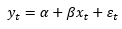
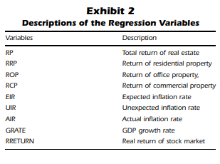
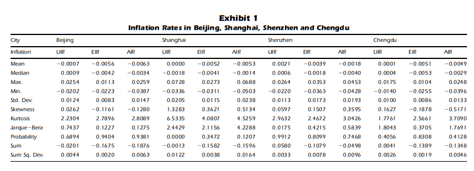
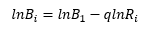

Although many western audiences understand the nature of the People’s Republic of China’s planned economy through the lens of eastern European models, the Communist Party of China’s economic policies had a much more profound impact on the country’s human development than its counterparts. While the regulation imposed by other Communist states was largely economic, Chinese regulations also centrally managed many other aspects of life that are today considered an integral part of human development. Up until 1983, the Chinese state had replaced traditional levels of administration with a system known as ‘people’s communes'. These organizational bodies were different from townships in that they centrally managed essentially all aspects of life, including even the movement of citizens and meal preparation. During this period of central planning, China’s development continued to lag other Asian countries until the abolishment of the people’s communes and the economic reforms of current Chinese president Deng Xiaoping. President Xiaoping is credited with moving China’s economic system from a centrally planned to a socialist market economy, which has led to a profound transformation in the country’s urbanization and social structure. While most cities and institutions throughout the developed world have been shaped by centuries of individual choices, China’s unique history has created circumstances in which the largest population in human history will reshape itself within the span of a couple decades. This creates a unique opportunity for data scientists, who for the first time in history will be able to analyze emerging complexity of urbanization with modern technology.

For this assignment, I will look at two specific approaches to assessing the organization of human populations: real estate prices and population flow. Through cointegration, we can macroeconomically assess the development of cities through traditional economic statistics, while logarithmic rank size models can track the movement of people. Since this course is designed to focus on the development of disadvantaged peoples, I have decided to create an evaluative research question that focuses on the welfare of China’s poorer rural communities. A convenient way to analyze the welfare of rural populations is urbanization, since urbanization is a requirement of higher standards of living and rural populations are be definition not yet urbanized. In order to measure human development from a rural point of view, my research question is the following: To what extend has the traditionally rural population of China benefitted from the recent growth of Chinese megacities?

The urbanization of China can be categorized as an emerging complex system due to the variety of people of variables. Although urbanization precipitated by the movement of people from lower to higher density areas, this movement is influenced by relative differences in wealth and education, as well as the interests of China’s central government. In addition, movement is influenced by geographical and economic factors that are outside the direct control of any party. The complexity of this system makes it useful to identify sub research questions that break up the problem into more approachable parts. First, it would be useful to identify what factors cause migration. It is also necessary to find out what factors make a city appealing to potential migrants, since this may help predict future migration. Lastly, it is important to acknowledge that the economy of China is still more regulated than any other developed nation. Can we still use traditional macroeconomic statistics to assess development, or will the distortion of market forces make econometric models ineffective?

As stated before, the two aspects this assignment will use to assess urbanization will be real estate prices and population flow. Inflation Hedging Characteristics of the Chinese Real Estate Market attempted to indirectly assess Chinese real estate by comparing the accessible statistics of real inflation rates and returns on investments in real estate. Traditionally, investors may choose to offset risk by hedging, or investing in other less promising areas in order to trade potential gains for less risk. Since a common symptom of rapid economic expansion is inflation, many Chinese investors have chosen to use real estate to hedge against inflation. By investing in real estate, investors can turn their monetary assets that could decrease in value into something else that theoretically has a more concrete value, like land. By analyzing the outcome of these investments, researchers can find how to value of land changes over time. In contrast to real estate prices, population flow is much more intuitive. In Geographical transformations of urban sprawl: Exploring the spatial heterogeneity across cities in China 1992-2015, researchers use time series models of migrant populations, GDP, and topographic data to identify what factors influence the cities migrants choose to move to. 

In the study involving real estate prices, cointegration was used to determine the relationship between real inflation and returns on real estate. Since real returns must account for losses due to inflation, researchers needed to model the relationship between inflation and returns. Cointegration is a method used to determine the relationship between two variables and does not need information regarding causality in order to be used. The equation used by the study is the following:

 
Y is the predicted returns, alpha and beta are constants created by the regression model, and x is a vector of the independent variables used to model returns. The study integrated a variety of independent variables for each region, an example of the variables for a few regions can be found here:

Additionally, epsilon represents the residuals, or distances between the datapoints inputted and trendline created by the regression model.

In the study involving population flow, logarithmic rank size models were used to model the popularity of cities relative to different statistics. The formula of each rank size model is the following:

 
B describes the relative size of any given area, while R is the ranking of that area relative to others. The variables i and 1 distinguish if the area is being measured relative to the city it is in, or a baseline major city that is used for all comparisons. The variable q models the current economic development of a given city. The rank size models were then used to generate a spatial distribution of China’s urban areas: 

The conclusions of both studies indicated that there was a significant and universal growth of urban areas throughout China, although there were some observations that indicate the unique nature of China’s urbanization process. The real estate prices study concluded that investors in real estate suffered steep loses, which does indicate that the growth in real estate prices, or development of land was larger than the growth in inflation. However, the study also found that the real rate of inflation for China in a large section of the timeseries data was negative, which is usually an indicator of a severe recession. Due to this discrepancy between the study’s findings and typical economic theory, I have concluded that the regulations of China’s socialist economy make attempts to evaluate urbanization through macroeconomic statistics impractical. 

In contrast to the real estate study, the data provided by the population flow study was shown to be effective by its researchers. The models created by the study were consistent with our general understanding of China’s population distribution and created incredibly concise data that could help with both future studies and urban planning. However, researchers found that unlike almost all other studies, economic growth was not a significant factor in determining were migrants settled. Instead, it found that relief degree of land service and geographical region determined migration. Identifying the cause behind economic growth’s lack of influence behind population flow is an important research gap that should be investigated in the future. Another research gap is a lack of data targeted at gender equality. Although there is a wide variety of data available concerning economic development and population mapping, data related to women’s issues such as access to birth control or gender disaggregated data is notably lacking in Chinese studies. 

Although China by many standards is a developed country, its unique economic conditions have created obstacles for researchers that are not different from countries in central Asia or sub Saharan Africa. While bottom up methods such as population distributions are effective at analyzing urbanization, bottom up methods such as the real estate study were not as effective. While this discrepancy is usually caused by a lack of infrastructure to gather data, researchers assessing China are instead challenged by the fact that age and growth of China’s emerging complex social system follows rules different from the ones governing our existing western societal structures. 

